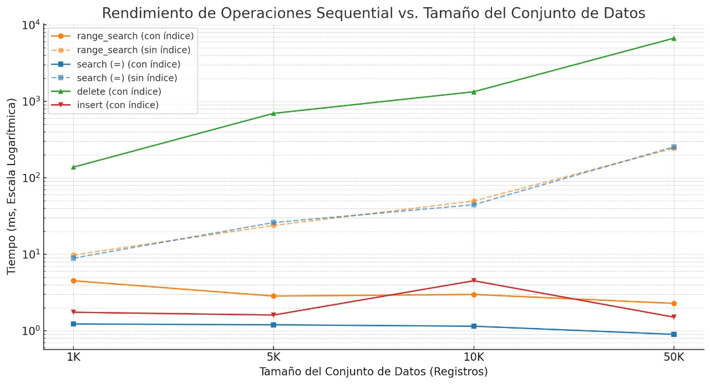
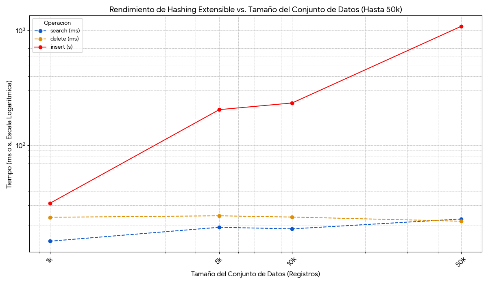
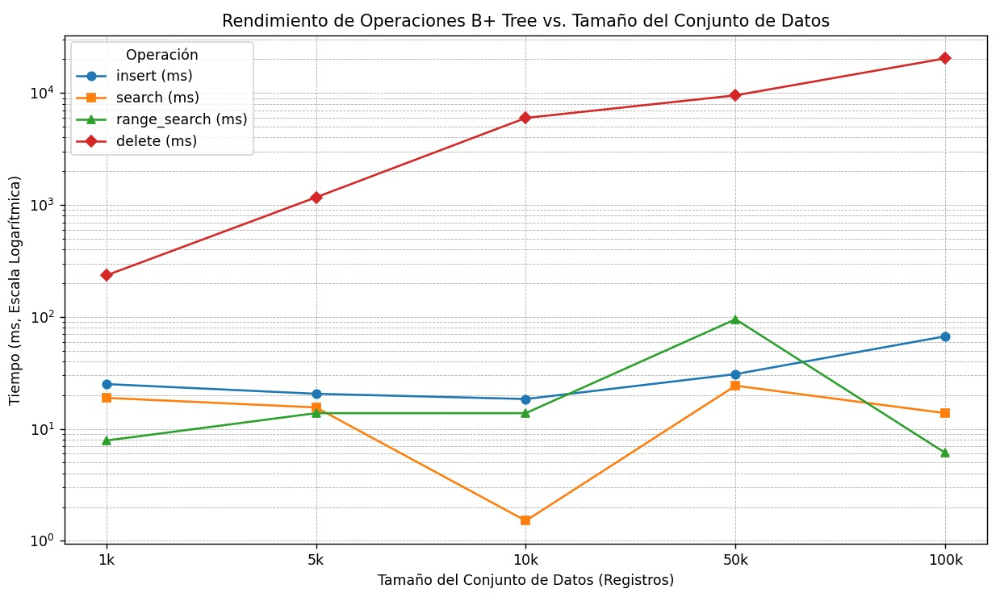
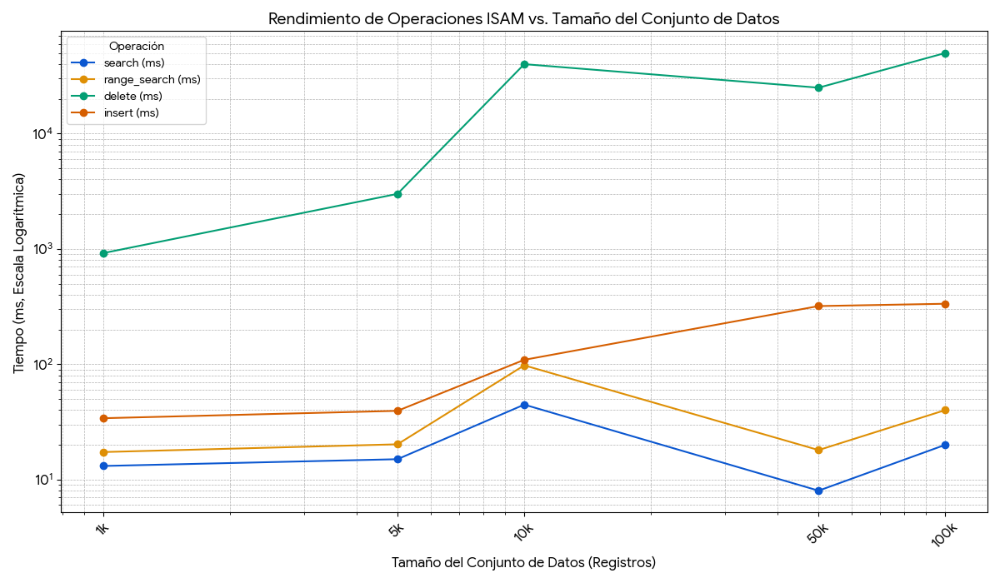
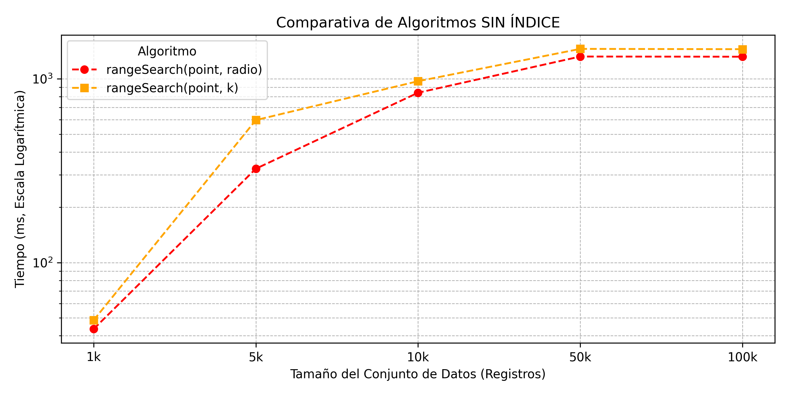
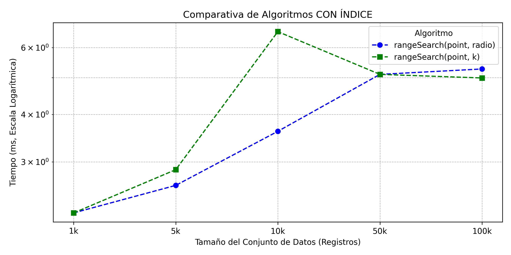

# Proyecto 1 - Base de datos II

# Integrantes: 

| Nombre Completo | Código|
| :--- | :--- | 
| Marco Madrid | 202320053  |
| Henry Quispe | 202320078 |
| Maria Surco | 202110358 |
| Juan Inca | 202310363  |
| Joaquin Huamán | 202210170 |

# Introducción

## Objetivo del Proyecto

El objetivo principal de este proyecto es **comprender y aplicar técnicas de organización e indexación de archivos físicos** para **optimizar la gestión, el almacenamiento y la recuperación eficiente de datos estructurados** dentro de un modelo relacional basado en tablas. Además, se explorará la integración de soporte para **datos espaciales**. El proyecto busca desarrollar un **mini gestor de bases de datos** que implemente las operaciones fundamentales de **inserción, eliminación y búsqueda** de manera eficiente.

***

## Descripción de la Aplicación

Se desarrollará una **herramienta de organización y gestión de archivos planos (flat files)** que maneja datos con distintas estructuras. 

Ejemplos de su uso incluyen:

* **Organización de Informes o Documentos:** Indexar grandes volúmenes de informes para búsquedas rápidas.
* **Gestión de Datos de Personas:** Almacenar y buscar eficientemente registros de usuarios o clientes.
* **Análisis de Datos de Compras/Transacciones:** Ordenar y consultar datos transaccionales, potencialmente incorporando **índices espaciales** para analizar ubicaciones geográficas de las transacciones.

La aplicación servirá como un banco de pruebas para **combinar e integrar diversas técnicas de indexación**, permitiendo la validación funcional del sistema mediante el uso de **archivos planos con datos reales**.

***

## Resultados Esperados

Al aplicar y comparar las diferentes técnicas de indexación (como B-trees, índices hash, y potencialmente estructuras de datos espaciales), esperamos obtener los siguientes resultados:

1. **Optimización del Rendimiento:** Lograr una **alta eficiencia** en las operaciones fundamentales (**inserción, eliminación y búsqueda**) en comparación con soluciones no indexadas o indexadas de forma subóptima.
2. **Claridad y Documentación:** Producir un **código con estructura clara** e incluir una **breve documentación técnica** que justifique el diseño, las decisiones de implementación (especialmente en la elección de las técnicas de indexación) y que detalle los resultados de las pruebas de rendimiento.
3. **Soporte a Datos Complejos:** Integrar con éxito el soporte para **datos espaciales**, ampliando la capacidad de la herramienta más allá de los datos puramente alfanuméricos.

# Parser

Hemos implementado nuestro **parser** dentro del directorio `core/src/parser`, el cual consta de dos componentes principales:

- **lexer.py**: tokenizador basado en expresiones regulares que convierte la consulta SQL en una secuencia de tokens `(kind, value)`.
- **parser.py**: analizador sintáctico que recorre los tokens generados y construye una representación intermedia (AST), utilizada posteriormente por los módulos `Executor` y `SchemaManager`.

---

## Flujo de funcionamiento

### 1. Tokenización (`lexer.py`)

En esta etapa, hemos definido en `token_re` los patrones necesarios para identificar los distintos tipos de tokens:

- `NUMBER`: `\d+(\.\d+)?` (reconoce números enteros y flotantes)
- `STRING`: `'...'` o `"..."` (cadenas entre comillas)
- `IDENT`: identificadores como nombres de tablas o columnas (letras, guiones bajos y números)
- `OP`: operadores como `=`, `<`, `>`, `<=`, `>=`, `between`, `in`
- `SYMBOL`: símbolos especiales (paréntesis, comas, corchetes, asterisco)
- `WS`: espacios en blanco (que son ignorados)

El **lexer** devuelve una lista de tuplas `(kind, value)` que representan la secuencia de tokens.  
En esta fase no realizamos ninguna conversión de tipos; simplemente agrupamos el texto según su categoría.

---

### 2. Análisis sintáctico (`parser.py`)

El método principal `SQLParser.parse(query)` es el encargado de procesar la consulta SQL.  
Su funcionamiento se resume en los siguientes pasos:

1. Llamamos a `tokenize(query)` para obtener la lista de tokens.  
2. Normalizamos los tokens, pasando a minúsculas los identificadores y operadores.  
3. Detectamos la operación principal de la consulta (`CREATE`, `INSERT`, `DELETE`, `SELECT`, `CREATE INDEX`) y delegamos a la función correspondiente:

   - **_parse_create**: extrae el nombre de la tabla, las columnas, los tipos de datos y el mapa de índices.  
   - **_parse_insert**: soporta tanto la forma `INSERT ... VALUES(...)` como la que incluye una lista de columnas; maneja paréntesis anidados y conserva las comillas hasta el procesamiento posterior.  
   - **_parse_delete**: obtiene la tabla objetivo y la condición especificada después de `WHERE`.  
   - **_parse_select**: extrae columnas, tabla, condición (entre `WHERE` y `USING/LIMIT`), y gestiona las cláusulas opcionales `USING` y `LIMIT`.  
   - **_parse_create_index**: extrae el tipo de índice, la tabla y la columna asociada.

Durante el preprocesamiento, los tokens `IDENT` y `OP` se **normalizan en minúsculas**, mientras que los tokens `STRING` y `NUMBER` se mantienen tal cual.

---

Con este parser, hemos logrado traducir consultas SQL sencillas a una **estructura interna manipulable**, manteniendo un diseño modular, claro y extensible.  
Esto nos permite integrar de manera eficiente la ejecución de comandos SQL dentro de nuestro sistema, además de facilitar futuras extensiones para soportar operaciones más complejas.

# Algoritmos

## Sequential

Para nuestro proyecto hemos desarrollado una estructura **Sequential Index File** (Archivo Secuencial Indexado con Zona Auxiliar), diseñada para mantener un **acceso ordenado y eficiente** a los registros almacenados en disco, combinando una **región principal estática (D)** con una **región auxiliar dinámica (A)**.

El objetivo de esta estructura es **preservar el orden lógico de los registros** sin necesidad de reescribir continuamente la totalidad del archivo, permitiendo **inserciones, búsquedas y eliminaciones eficientes**, y reorganizando periódicamente el contenido para compactar la información.

### Arquitectura general

El archivo secuencial se compone de tres elementos principales:

1. **Región principal (D):** Contiene los registros ordenados de forma compacta. Es el cuerpo base del índice y se construye de manera batch, garantizando el orden físico por clave.
2. **Región auxiliar (A):** Espacio destinado a las nuevas inserciones. Los registros se enlazan mediante punteros lógicos (`next_ptr`), conservando el orden lógico total sin modificar la región D.
3. **Cabecera (Header):** Contiene tres valores clave:
   - `main_count`: cantidad de registros en la región D.  
   - `aux_count`: cantidad de registros en la región A.  
   - `head_ptr`: puntero lógico al primer registro del orden total.

Esta estructura **mantiene una lista lógica ordenada** (`head_ptr → next_ptr → ...`) que conecta registros de ambas regiones, haciendo posible recorrer los datos en orden creciente de claves, aun cuando los nuevos registros se encuentren físicamente dispersos.

---

### Insert

La operación `insert()` agrega nuevos registros sin alterar la región principal, preservando el orden lógico:

1. **Ubicación de inserción:**  
   Se utiliza una **búsqueda binaria** sobre la región principal (D) para determinar el punto de inserción adecuado (`lower_bound_d`).  
2. **Inserción en la región auxiliar (A):**  
   - Se crea un nuevo registro con su `offset` y `value`.  
   - El registro se escribe al final de la región auxiliar.  
3. **Actualización de punteros lógicos:**  
   - Si la lista está vacía, el nuevo registro se convierte en el `head_ptr`.  
   - En caso contrario, se recorren los punteros hasta ubicar el predecesor (`prev_ptr`) y el sucesor (`cur_ptr`), y se inserta el nuevo nodo entre ambos (`prev → new → cur`).  
4. **Reorganización periódica:**  
   Para evitar que la zona auxiliar crezca indefinidamente, el sistema activa una **reorganización automática** cuando el tamaño de `A` supera un umbral dependiente de `log₂(main_count)`.  
   En esta reorganización, todos los registros válidos de D y A se fusionan en una nueva D ordenada.

**Complejidad:**  
- Promedio: O(log n + m)  
- Mejor caso: O(log n)  
 donde *m* es el número de nodos en la zona auxiliar antes de la reorganización.

---

### Delete

La operación `delete()` recorre la lista lógica y **marca los registros como eliminados (tombstone)**, sin necesidad de compactar inmediatamente el archivo.

1. **Recorrido lógico:**  
   Se parte del `head_ptr` y se avanza siguiendo los punteros `next_ptr`.  
2. **Comparación ordenada:**  
   Dado que la lista está ordenada por clave, si `key_actual > key_buscada`, el proceso puede detenerse anticipadamente.  
3. **Marcado de eliminación:**  
   Cuando se encuentra un valor igual a la clave (`value == key`), el campo `offset` se sustituye por `DELETED_PTR = -1`, dejando constancia de la eliminación.  
4. **Reorganización diferida:**  
   Los registros eliminados no se borran físicamente hasta la siguiente reorganización, donde se vuelca la lista limpia en una nueva región principal compacta.

**Complejidad:**  
- O(n) en el peor caso, pero en la práctica O(log n + m) gracias al orden lógico y a la posibilidad de corte temprano.

---

### Search

La función `search()` permite recuperar todos los `offsets` cuyos valores coincidan con una clave dada.

1. **Inicio en el puntero principal (`head_ptr`):**  
   Se recorre la lista ordenada enlazada que une tanto registros de D como de A.  
2. **Comparación progresiva:**  
   - Si el valor actual es menor que la clave, se continúa.  
   - Si es igual, se añade el `offset` a los resultados.  
   - Si es mayor, la búsqueda se detiene (ya que los siguientes serán mayores).  
3. **Eficiencia:**  
   Gracias al orden lógico, la búsqueda se realiza con una complejidad O(log n + k), donde *k* es el número de coincidencias.

---

### Range Search

El método `search_range(lo, hi)` permite realizar búsquedas por **rango de valores** `[lo, hi]` en orden ascendente.

1. **Identificación del punto inicial:**  
   Se realiza una **búsqueda binaria (`lower_bound_d`)** sobre la región D para localizar el primer registro cuyo valor sea mayor o igual a `lo`.  
2. **Exploración secuencial:**  
   Desde el registro encontrado o desde el `head_ptr` si no existe un predecesor, se recorre la lista lógica usando los punteros `next_ptr`.  
3. **Filtrado por rango:**  
   - Los registros con `value < lo` son omitidos.  
   - Se añaden todos los `offsets` con valores dentro del rango.  
   - Al superar `hi`, el recorrido se detiene (la lista está ordenada).  
4. **Resultado:**  
   Se devuelve la lista de `offsets` que cumplen la condición, ya ordenada de manera natural.

**Complejidad:**  
O(log n + k), siendo *k* el número de registros dentro del rango.

---

### Resumen Sequential

| **Algoritmo**   | **Mejor Caso** | **Peor Caso**          |
|------------------|----------------|-------------------------|
| Insert           | O(log n)       | O(log n + m)           |
| Delete           | O(log n)       | O(log n + m)           |
| Search           | O(log n)       | O(log n + k)           |
| Range Search     | O(log n + k)   | O(log n + k + m)       |

**Leyenda:**  
- *n*: número de registros en la región principal (D).  
- *m*: número de registros en la región auxiliar (A).  
- *k*: número de resultados devueltos en la búsqueda o rango.
### Extendible Hashing

## Descripción general
El Extendible Hashing es un índice dinámico en disco que organiza pares (key, row_off) usando una función hash.
A medida que los datos crecen, el índice se adapta automáticamente: divide solo los buckets que se llenan y expande el directorio cuando el desborde se vuelve largo (rehash global).
Gracias a esto, mantiene costos promedio cercanos a O(1) para búsquedas, inserciones y borrados, incluso con grandes volúmenes de datos.
Este método permite que el índice crezca dinámicamente sin necesidad de reconstruirse desde cero, y mantiene su eficiencia al controlar la longitud media de las cadenas de overflow.

## Proceso de construcción

### Inicialización de archivos
- Archivo .dir (directorio): contiene la cabecera (D, dir_count = 2^D) y 2^D celdas de 4 bytes con punteros a buckets.
- Archivo .bkt (buckets): crea dos buckets base (d = 1) y reparte las claves por su último bit.

### Carga de registros
Se itera sobre la tabla base y, para cada fila, se ejecuta:
insert(key, row_off)
Cada inserción determina el bucket adecuado según el valor de hash(key) y lo almacena en el bucket correspondiente.

### Estructuras resultantes
Una vez creado el índice, se obtiene:
- Directorio con profundidad global D vigente.
- Conjunto de buckets base, cada uno con:
  - Profundidad local d
  - Contador count
  - Puntero next_ptr (hacia bucket de overflow)
  - suffix (bits del hash que identifican el bucket)
  - Posibles cadenas de overflow

## Estructura en disco
El índice está compuesto por dos archivos principales:

### Directorio (.dir)
Guarda la profundidad global D y un arreglo de 2^D punteros a buckets.  
El directorio puede duplicarse cuando ocurre un rehash global.

### Buckets (.bkt)
Cada bucket almacena hasta B entradas (key, row_off), su profundidad local d, un sufijo y un puntero next_ptr al siguiente bucket cuando hay overflow.  
El puntero nulo real es -1.

## Insert
Para insertar un registro, se calcula:
idx = hash(key) mod 2^D
y se escribe en el bucket base correspondiente.

### Casos de inserción
- Si hay espacio:
  Se agrega la entrada directamente.
  Costo promedio: O(1).

- Si el bucket está lleno y d < D:
  Se realiza un split local:
  El bucket se divide en dos (d + 1).
  Se redistribuyen las entradas (incluyendo su cadena de overflow) según el nuevo bit.
  El directorio actualiza solo las entradas que apuntaban a ese bucket.
  Costo: O(s), donde s es el número de entradas reinsertadas.

- Si el bucket está lleno y d = D:
  Si la cadena de overflow alcanzó MAX_CHAIN, se realiza un rehash global:
  Se duplica el directorio (D := D + 1).
  Se cortan las cadenas de overflow.
  Se reinsertan todas las entradas de overflow de los buckets base.
  Costo: O(T), donde T es el total de entradas reinsertadas.
  Si no se alcanza MAX_CHAIN, se encadena otro bucket de overflow al final.
  Costo amortizado: O(1).

## Search
Para buscar una clave:
1. Se calcula el índice idx = hash(key) mod 2^D.
2. Se lee el bucket base correspondiente.
3. Si no se encuentra, se recorre su cadena de overflow siguiendo next_ptr.
4. Devuelve todos los row_off que coinciden con la clave.

Costos:
- Promedio: O(1 + L̄)
- Peor caso: O(L)
Donde:
- L̄ es la longitud media de la cadena.
- L es la longitud máxima antes del rehash.

## Delete
Para eliminar una clave:
1. Se localiza el bucket usando la función hash.
2. Se eliminan todas las coincidencias compactando con swap desde el último registro válido.
3. Si un bucket de overflow queda vacío, se desenlaza de la cadena.
4. Si el bucket base queda vacío, las entradas del directorio que lo apuntaban se redirigen al siguiente bucket disponible.

Costos:
- Promedio: O(1 + L̄)
- Peor caso: O(L)

## Control de colisiones (Split, Overflow y Rehash)
El Extendible Hashing maneja las colisiones mediante tres mecanismos:

1. Split local:
   Si el bucket puede dividirse (d < D), se redistribuyen las entradas según el nuevo bit del hash.

2. Encadenamiento (Overflow):
   Si el bucket alcanza su capacidad máxima y no puede dividirse (d = D), se agrega un bucket de overflow enlazado.

3. Rehash global:
   Si las cadenas de overflow superan MAX_CHAIN, se duplica el directorio (D := D + 1) y se reinsertan los registros de overflow.

Este mecanismo garantiza que la longitud media de las cadenas (L̄) se mantenga baja, preservando los costos amortizados O(1).

## Complejidad de operaciones
Operación | Costo promedio | Peor caso
-----------|----------------|-----------
Build (creación y carga de datos) | O(N) + O(T) | —
Insert | O(1) | O(s) / O(T)
Search | O(1 + L̄) | O(L)
Delete | O(1 + L̄) | O(L)

Parámetros:
- N: número de registros
- B: capacidad del bucket
- D: profundidad global
- L̄: longitud media de cadena
- L: longitud máxima de cadena
- s: número de entradas reinsertadas en un split local
- T: número de entradas de overflow reinsertadas en un rehash global

## Resumen
El Extendible Hashing mantiene el equilibrio entre espacio y velocidad al adaptar dinámicamente su estructura:
- Divide solo los buckets necesarios.
- Encadena temporalmente buckets de overflow.
- Duplica el directorio solo cuando es imprescindible.

Con esta estrategia, logra un rendimiento cercano a O(1) en la mayoría de las operaciones, ofreciendo una solución escalable y eficiente para el manejo de grandes volúmenes de datos en disco.

## BPluss Tree
Este módulo proporciona una implementación de un índice **Árbol B+** (`BPlusTree`) que opera directamente sobre disco, utilizando la clase auxiliar `BPlusNode` para representar los nodos del árbol. Está diseñado específicamente para funcionar como un índice secundario, mapeando **claves** a **punteros** (offsets) que indican la ubicación de los registros completos en un archivo de datos principal.

La estructura se basa en nodos (`BPlusNode`) de tamaño fijo, determinado por la constante `ORDER` (que define el número máximo de claves por nodo). Esto optimiza las operaciones de I/O al leer/escribir bloques de tamaño predecible. 

Características clave:
- **Persistencia en Disco:** Toda la estructura del árbol reside en un archivo binario (`.idx`).
- **Balanceado:** El árbol se mantiene balanceado automáticamente durante inserciones y eliminaciones, garantizando un rendimiento logarítmico.
- **Nodos Hoja Enlazados:** Los nodos hoja están conectados secuencialmente (`next_leaf`), permitiendo búsquedas por rango eficientes.
- **Manejo de Tipos (Intento):** Incluye una función de comparación (`_cmp`) que intenta manejar claves numéricas y de texto, aunque el empaquetado/desempaquetado actual está fijo para enteros.

---

### Insert

La inserción de un par `(clave, puntero)` sigue estos pasos:
1.  **Búsqueda:** Se busca la **hoja** apropiada donde debería residir la nueva clave, descendiendo desde la raíz y usando búsqueda binaria (`binary_intern`) en cada nodo interno.
2.  **Inserción en Hoja:**
    * Si la hoja tiene espacio (menos de `ORDER` claves), la clave y el puntero se insertan manteniendo el orden. Se utiliza `bisect_left` (adaptado con `_cmp`) para encontrar la posición correcta.
    * Si la hoja está **llena** (`ORDER` claves), se produce un **split**:
        * La hoja se divide en dos nodos hoja.
        * La clave central (aproximadamente) se **promueve** al nodo padre.
        * Los punteros `next_leaf` se actualizan para mantener la cadena.
3.  **Propagación de Splits:** Si la promoción de una clave causa que un **nodo interno** se llene, este también se divide:
    * El nodo interno se divide en dos.
    * La clave central se promueve al padre.
    * Este proceso puede continuar recursivamente **hasta la raíz**. Si la raíz se divide, la **altura del árbol aumenta** en uno.

La complejidad típica de la inserción es **O(logB N)**, donde B es el `ORDER` y N el número de claves, debido a la naturaleza balanceada del árbol.

---

### Delete

La eliminación de una clave sigue un proceso similar pero inverso al de inserción:
1.  **Búsqueda:** Se localiza la **hoja** que contiene la clave a eliminar, descendiendo desde la raíz.
2.  **Eliminación en Hoja:** Se elimina la clave y su puntero asociado de la hoja.
3.  **Manejo de Underflow:** Si, tras la eliminación, el número de claves en la hoja cae por debajo del mínimo (`MIN_KEYS`), se produce un **underflow**:
    * **Préstamo (Redistribución):** Se intenta tomar prestada una clave del hermano izquierdo o derecho si este tiene claves suficientes (más de `MIN_KEYS`). Esto implica ajustar también la clave separadora en el nodo padre.
    * **Fusión (Merge):** Si ninguno de los hermanos puede prestar, la hoja se fusiona con uno de sus hermanos (izquierdo o derecho). Esto requiere eliminar la clave separadora del nodo padre.
4.  **Propagación de Underflow:** La eliminación de una clave en el padre (debido a una fusión) puede causar un underflow en el nodo interno. Este se maneja de forma similar: intentando redistribuir con un hermano interno o fusionando nodos internos. Este proceso puede propagarse **hasta la raíz**. Si la raíz queda vacía (con un solo puntero), esa raíz se elimina y su único hijo se convierte en la nueva raíz, **disminuyendo la altura** del árbol.

La complejidad típica de la eliminación también es **O(logB N)**.

---

### Search

La búsqueda de una clave específica (`search` o `find`) es muy eficiente:
1.  **Descenso:** Se comienza en la raíz y se utiliza búsqueda binaria (`binary_intern` adaptado con `_cmp`) en cada nodo interno para decidir qué puntero seguir hacia el siguiente nivel.
2.  **Localización en Hoja:** Al llegar a un nodo hoja, se usa búsqueda binaria (`binary_leaf` adaptado con `_cmp`) para encontrar la clave exacta.
3.  **Resultado:**
    * `search`: Devuelve el primer puntero encontrado para esa clave (o `None`).
    * `find`: Devuelve una **lista** de todos los punteros asociados a esa clave (maneja duplicados), escaneando hacia los lados en la hoja y potencialmente en las hojas siguientes si hay duplicados que cruzan límites de nodo.

La complejidad de encontrar la primera clave es **O(logB N)**. La función `find` puede tener una complejidad adicional si hay muchos duplicados (`+d`, donde `d` es el número de duplicados).

---

### Range Search

Gracias a los punteros `next_leaf`, la búsqueda por rango (`range_search(inicio, fin)`) es eficiente:
1.  **Localizar Inicio:** Se busca la **hoja** y la posición donde debería estar `begin_key` (usando la misma lógica de descenso que `search`).
2.  **Escaneo Secuencial:**
    * Se recorren las claves/punteros en la hoja actual desde la posición encontrada. Si una clave está dentro del rango `[begin_key, end_key]`, se añade su puntero a los resultados.
    * Si se llega al final de la hoja actual, se sigue el puntero `next_leaf` para pasar a la siguiente hoja.
    * Se repite el escaneo en las hojas siguientes.
3.  **Terminación:** El proceso se detiene cuando se encuentra una clave mayor que `end_key` o cuando se llega al final de la última hoja.

La complejidad es **O(logB N + k)**, donde `log N` es el costo de encontrar la hoja inicial y `k` es el número de elementos dentro del rango recuperados.

---

### Resumen B+ Tree

| Algoritmo      | Complejidad Típica | Notas                                                    |
| :------------- | :----------------- | :------------------------------------------------------- |
| Insert         | O(logB N) | Puede involucrar splits que suben hasta la raíz.           |
| Delete         | O(logB N) | Puede involucrar merges/redistribuciones hasta la raíz. |
| Search (Exacto) | O(logB N) | Búsqueda logarítmica hasta la hoja.                    |
| Find (Duplicados)| O(logB N + d) | `d` = número de duplicados encontrados.               |
| Range Search   | O(logB N + k) | `k` = número de elementos en el rango.                |

*(N es el número total de claves en el índice, B es el `ORDER` del árbol)*

## ISAM

Para nuestro proyecto hemos desarrollado una estructura **ISAM** (*Indexed Sequential Access Method*) diseñada para optimizar las búsquedas en grandes volúmenes de datos almacenados en disco.

Nuestro ISAM implementa una arquitectura **multinivel**, conformada por **tres niveles de índices jerárquicos**, donde:  
- **Nivel 1 y Nivel 2:** Actúan como índices intermedios (nivel raíz y secundario) que apuntan a las páginas de datos ubicadas en el nivel 3.  
- **Nivel 3:** Contiene los registros reales, ordenados por clave.  
- **Overflow:** Almacena los registros adicionales que exceden la capacidad del *batch* inicial.  

La estructura se construye inicialmente de forma **batch**, ordenando todos los registros según la clave. Esto garantiza búsquedas eficientes con una complejidad de **O(log n)** mediante búsqueda binaria en cada nivel.  
Para manejar inserciones posteriores sin necesidad de reorganizar los índices estáticos, ISAM implementa un sistema de **páginas de overflow encadenadas**, que almacenan los nuevos registros manteniendo la consistencia del acceso secuencial.

---

### Insert

Esta función utiliza el mismo mecanismo de búsqueda binaria multinivel que `search()` para localizar la página de datos donde debe insertarse el nuevo registro según su clave.  
Se presentan dos casos principales:

- **Caso 1:** Si la página principal tiene espacio disponible (menos de **BLOCK_FACTOR** registros), el registro se inserta directamente, se mantiene el orden ascendente por ID y se actualiza la página en disco.  
- **Caso 2:** Si la página está llena, el sistema recurre al mecanismo de *overflow*:  
  - Si no existe una cadena de overflow, se crea una nueva página y se enlaza mediante el puntero **next_page**.  
  - Si ya existe, se recorre la cadena hasta encontrar una página con espacio o se crea una nueva al final de la cadena.

---

### Delete

El algoritmo navega por los índices multinivel utilizando búsqueda binaria para ubicar la página de datos correspondiente.  
Una vez identificada, filtra los registros de la página principal creando una nueva lista que excluye el registro con la clave especificada.  
Si el tamaño de la lista disminuye, significa que el registro fue encontrado y eliminado; en ese caso, la página se actualiza y la operación retorna `TRUE`.  
Si el registro no se encuentra en la página principal pero existe una cadena de overflow, el proceso se repite recorriendo secuencialmente cada página de overflow hasta eliminar el registro o agotar la cadena.

---

### Search

Primero se carga el índice de **nivel 1 (raíz)** y se aplica una búsqueda binaria para determinar qué página de **nivel 2** explorar.  
Luego se repite el proceso en el nivel 2 para identificar la página de datos correspondiente del nivel 3.  
Una vez en la página de datos, se recorre la lista de registros de forma secuencial hasta encontrar la clave buscada.  
Si el registro no está en la página principal y existe una cadena de overflow (indicada por `next_page != -1`), se continúa la búsqueda recorriendo todas las páginas de overflow encadenadas hasta hallarlo o llegar al final de la cadena.

---

### Range Search

El algoritmo identifica las páginas de **nivel 2** que podrían contener los límites del rango mediante búsqueda binaria en el **nivel 1**.  
Posteriormente, determina todas las páginas intermedias entre `nivel_2_start` y `nivel_2_end` que potencialmente almacenan datos dentro del rango.  
Para cada página de nivel 2 identificada, se repite el proceso en el **nivel 3**: se localizan las páginas de datos que contienen los límites inferior y superior, y se exploran todas las páginas intermedias.  
En cada página de datos visitada, se recopilan los registros cuyo ID se encuentra dentro del rango especificado.
Finalmente, los resultados se ordenan por ID antes de retornarlos.

---

### Resumen ISAM

| Algoritmo     | Mejor Caso    | Peor Caso       |
|:-------------- |:--------------|:----------------|
| Insert         | O(log n)      | O(log n + m)    |
| Delete         | O(log n)      | O(log n + m)    |
| Search         | O(log n)      | O(log n)        |
| Range Search   | O(log n + k)  | O(log n + k)    |

## R-tree
Estructura de datos de árbol diseñada específicamente para indexar información espacial multidimensional La idea central del R-tree es agrupar objetos espaciales cercanos y representarlos con un Rectángulo Mínimo Delimitador (MBR, por sus siglas en inglés) en el nodo padre. El árbol es una jerarquía de estos MBRs:
- Nodos Hoja: Contienen punteros a los objetos de datos reales (ej: la geometría de una ciudad).
- Nodos Internos: Contienen punteros a sus nodos hijos, junto con el MBR que encierra todos los MBRs de sus hijos.

### Características Principales
- Multidimensional: A diferencia de los B-trees que indexan datos de una sola dimensión (ej: un número de ID), los R-trees pueden indexar 2 o más dimensiones simultáneamente.
- Dinámico: Soporta inserciones y eliminaciones de forma eficiente (como vimos en las pruebas de INSERT y DELETE), reajustando el árbol (balanceo, división de nodos) según sea necesario.
- Balanceado: Al igual que un B-tree, todos los nodos hoja se encuentran en el mismo nivel, garantizando que los tiempos de búsqueda no degeneren.
- Superposición (Overlapping): Esta es la característica clave y la principal diferencia con los B-trees. Dado que es imposible dividir el espacio 2D perfectamente sin cortar objetos, los MBRs de los nodos hermanos pueden superponerse. Esto implica que una consulta de búsqueda a veces puede necesitar descender por múltiples ramas del árbol.

---

### RangeSearch (Radio) - rangeSearch(point, radio):
Esta operación define un "círculo de búsqueda". Su objetivo es encontrar y devolver todos los objetos (ciudades) que se encuentran dentro de una distancia (radio) específica desde un punto de consulta central. El número de resultados es variable, ya que depende de cuántos puntos caigan dentro de esa área. El algoritmo sigue un procedimiento de escaneo y filtrado: primero, recibe las entradas del punto central y un radio; luego, itera la tabla completa, fila por fila. Por cada fila, calcula la distancia geodésica exacta entre el punto de esa fila y el punto central. Después, compara la distancia calculada con el radio; si la distancia es menor o igual al radio, la fila se añade al conjunto de resultados, de lo contrario, se ignora. Finalmente, una vez que ha revisado todas las filas, el algoritmo devuelve el conjunto completo de todas las filas que cumplieron la condición.

---

### RangeSearch (KNN) - rangeSearch(point, k)
Esta operación, conocida como K-Nearest Neighbors (KNN), no le importa una distancia fija, sino que su objetivo es encontrar un número fijo (k) de objetos que estén lo más cerca posible del punto de consulta. El número de resultados es fijo (siempre será $k$). El algoritmo es computacionalmente más complejo, ya que implica un ordenamiento: primero, recibe las entradas del punto central y un número $k$. Luego, itera la tabla completa, fila por fila, y por cada una calcula la distancia geodésica exacta al punto central. En lugar de filtrar, almacena temporalmente cada fila junto con su distancia calculada. Una vez que ha calculado la distancia para todas las filas, realiza una operación de ordenamiento (Sort) masiva sobre toda la lista, ordenándola por la distancia calculada de menor a mayor. Después, toma las primeras $k$ filas de esa lista ya ordenada y, finalmente, devuelve ese subconjunto como resultado.

---
| Algoritmo | Mejor/Promedio Caso | Peor Caso |
| :--- | :---: | :---: |
| Insert | $O(\log n)$ | $O(n)$ |
| Delete | $O(\log n)$ | $O(n)$ |
| `rangeSearch(point, radio)` | $O(\log n + k)$ | $O(n + k)$ |
| `rangeSearch(point, k)` [KNN] | $O(\log n + k)$ | $O(n + k)$ |

Donde:
- $n$: Es el número total de elementos indexados.
- $k$: Es el número de elementos devueltos por la consulta.
- $O(n)$ (Peor Caso): A diferencia de un B+tree, el peor caso de un R-tree es lineal. Esto se debe a que las "cajas" (MBRs) de los nodos pueden superponerse, y una consulta podría teóricamente verse forzada a explorar casi todas las ramas del árbol.

---

# Experimentación

## Sequential

## Hash

## BPlus Tree

## ISAM

## Rtree
### Sin Indice

### RTree con Indice

# Conclusiones
