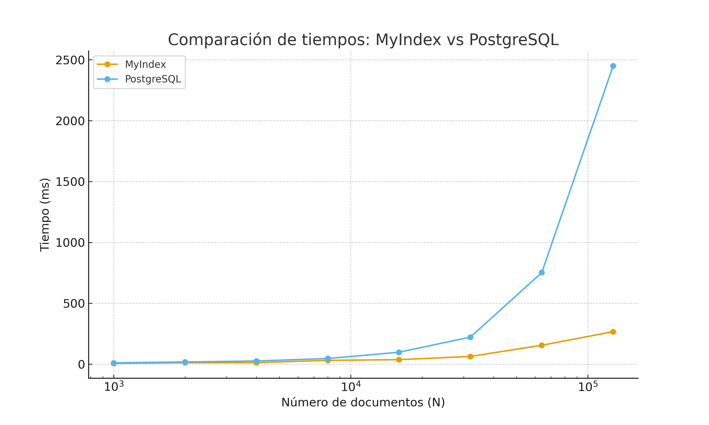

# Proyecto 2 - Base de Datos Multimodal
## Gestión de Índices Avanzados para Búsqueda Multimodal

---

## 👥 Integrantes

| Nombre Completo | Código |
| :--- | :--- |
| Marco Madrid | 202320053 |
| Henry Quispe | 202320078 |
| Maria Surco | 202110358 |

---

## 📋 Tabla de Contenidos
- [Introducción](#introducción)
- [Backend - Índice Invertido para Texto](#backend---índice-invertido-para-texto)
- [Backend - Índice Invertido para Descriptores Locales](#backend---índice-invertido-para-descriptores-locales)
- [Frontend](#frontend)
- [Experimentación](#experimentación)

---

## 🎯 Introducción

### Dominio de Datos

Este proyecto implementa una **base de datos multimodal** diseñada para gestionar y recuperar información de diferentes tipos de datos:

- **Texto**: Letras de canciones, documentos, artículos
- **Imágenes**: Fotografías, ilustraciones, gráficos (pendiente)
- **Audio**: Archivos de música, características acústicas (pendiente)

### Justificación de la Base de Datos Multimodal

La necesidad de una base de datos multimodal surge de la creciente demanda de sistemas que puedan:

1. **Búsqueda Unificada**: Permitir búsquedas que combinen diferentes tipos de contenido
2. **Recuperación Eficiente**: Utilizar índices especializados para cada tipo de dato
3. **Escalabilidad**: Manejar grandes volúmenes de datos multimedia
4. **Precisión**: Ofrecer resultados relevantes mediante técnicas avanzadas de similitud

Este sistema es especialmente útil para:
- Plataformas de streaming musical (búsqueda por letra, características de audio)
- Bibliotecas digitales multimodales
- Sistemas de gestión de contenido multimedia
- Aplicaciones de búsqueda empresarial

---

## 🔧 Backend - Índice Invertido para Texto

### Construcción del Índice Invertido en Memoria Secundaria

#### Descripción del Proceso

El índice invertido para texto se construye utilizando la técnica **SPIMI (Single-Pass In-Memory Indexing)**, que permite procesar grandes volúmenes de documentos de manera eficiente sin cargar todo el dataset en memoria.

**Proceso de construcción implementado:**

1. **Lectura de Documentos**: Se procesan documentos de texto de forma secuencial
2. **Preprocesamiento**:
   - **Tokenización**: División del texto en palabras individuales
   - **Normalización**: Conversión a minúsculas y eliminación de acentos
   - **Eliminación de Stopwords**: Remoción de palabras comunes sin valor semántico (ej: "el", "la", "de")
   - **Stemming**: Reducción de palabras a su raíz usando Porter Stemmer
   
3. **Construcción de Bloques en Memoria**:
   ```python
   # Pseudocódigo del algoritmo SPIMI
   while hay_documentos():
       bloque = {}
       while memoria_disponible():
           doc = leer_documento()
           tokens = preprocesar(doc)
           for token in tokens:
               bloque[token].add(doc_id, frecuencia)
       escribir_bloque_a_disco(bloque)
   ```

4. **Merge de Bloques**: Los bloques parciales se combinan en un índice final unificado

5. **Cálculo de TF-IDF**:
   - **TF (Term Frequency)**: `TF = 1 + log(freq)` si freq > 0
   - **IDF (Inverse Document Frequency)**: `IDF = log(N / df)` donde df = documentos que contienen el término
   - **TF-IDF**: `TF-IDF = TF × IDF`

6. **Normalización de Vectores**: Cálculo de normas de documentos para similitud coseno

#### Ejecución Eficiente con Similitud de Coseno

La búsqueda de documentos relevantes se realiza mediante **similitud de coseno**, que mide el ángulo entre vectores de términos:

```
similitud(d, q) = (d · q) / (||d|| × ||q||)
```

**Algoritmo de búsqueda implementado:**

```python
def search(query, top_k):
    # 1. Preprocesar query
    terms = preprocess(query)
    
    # 2. Calcular TF-IDF de query
    query_vector = calculate_tfidf(terms)
    
    # 3. Encontrar documentos candidatos
    candidates = get_documents_with_terms(terms)
    
    # 4. Calcular similitud para cada candidato
    scores = []
    for doc_id in candidates:
        doc_vector = get_document_vector(doc_id)
        score = cosine_similarity(query_vector, doc_vector)
        scores.append((doc_id, score))
    
    # 5. Retornar Top-K usando min-heap
    return heapq.nlargest(top_k, scores, key=lambda x: x[1])
```

**Optimizaciones implementadas:**

1. **Uso de Heap para Top-K**: Solo se mantienen los K mejores resultados en memoria
2. **Filtrado de Candidatos**: Solo se evalúan documentos que contienen al menos un término de la query
3. **Normalización Precomputada**: Las normas de documentos se calculan una vez durante la construcción del índice

**Complejidad:**
- **Construcción**: O(N × L) donde N = número de documentos, L = longitud promedio
- **Búsqueda**: O(V + C × log K) donde V = vocabulario, C = candidatos, K = top-k

#### Explicación del Mecanismo de Construcción en PostgreSQL

Nuestro sistema también integra PostgreSQL para comparación y validación:

**1. Creación de Índice GIN (Generalized Inverted Index)**:
```sql
-- Crear columna tsvector para búsqueda full-text
ALTER TABLE songs ADD COLUMN lyrics_tsv tsvector;

-- Actualizar con texto preprocesado
UPDATE songs SET lyrics_tsv = to_tsvector('english', lyrics);

-- Crear índice GIN
CREATE INDEX idx_lyrics_gin ON songs USING GIN(lyrics_tsv);
```

**2. Búsqueda con ts_rank**:
```sql
SELECT 
    id, 
    title,
    ts_rank(lyrics_tsv, query) AS rank
FROM songs, 
     to_tsquery('english', 'love & music') AS query
WHERE lyrics_tsv @@ query
ORDER BY rank DESC
LIMIT 10;
```

**Ventajas de la integración con PostgreSQL:**
- Transacciones ACID
- Consultas SQL complejas
- Operadores booleanos avanzados (AND, OR, NOT, frases)
- Respaldo y recuperación automática
- Escalabilidad probada en producción

**Diferencias clave con MyIndex:**
- PostgreSQL aplica stemming y normalización más agresiva
- Usa ranking tf-idf normalizado (puntajes más bajos pero más consistentes)
- Soporta búsquedas booleanas complejas
- Mayor overhead pero más robusto para producción


La interfaz está diseñada siguiendo principios de **Material Design** y **UX modernas**:

**Características principales implementadas:**

1. **Búsqueda de Texto**:
   - Barra de búsqueda central
   - Selección de índice (MyIndex vs PostgreSQL)
   - Configuración de Top-K resultados
   - Visualización de resultados con scores

2. **Visualización de Resultados**:
   - Lista ordenada por relevancia
   - Snippets de texto con términos destacados
   - Scores de similitud
   - Tiempo de ejecución


### Mini-Manual de Usuario

#### Búsqueda de Texto

1. **Acceder a la interfaz**: `http://localhost:3000/text-search`
2. **Seleccionar método de búsqueda**:
   - MyIndex (índice invertido personalizado)
   - PostgreSQL (full-text search nativo)
3. **Ingresar consulta**: Escribe el texto a buscar
4. **Configurar parámetros**:
   - Top-K: Número de resultados (default: 10)
5. **Ver resultados**: Ordenados por similitud descendente

---

## 📊 Experimentación

### Búsqueda de Texto - Resultados Experimentales

#### Configuración del Experimento

**Dataset**: Spotify Songs with Lyrics  
**Fuente**: https://www.kaggle.com/datasets/bwandowando/spotify-songs-with-attributes-and-lyrics

**Tamaños de dataset evaluados**:
- 1k, 2k, 4k, 8k, 16k, 32k, 64k, 128k canciones

**Consulta de prueba**:
```
"My bags were packed from the day I was born Yeah I'm leaving one way or another Curiosity has got the best of me Yeah I'm leaving one way or another"
```

**Métricas medidas**:
1. Tiempo de respuesta (ms)
2. Similarity Score del primer resultado
3. ID del documento recuperado

#### Resultados Comparativos

##### Tabla 1: Comparación de Tiempos de Ejecución

| Dataset Size | MyIndex Time (ms) | PostgreSQL Time (ms) | Speedup |
|--------------|-------------------|----------------------|---------|
| 1k           | 6.22              | 11                   | 1.77x   |
| 2k           | 11.83             | 18                   | 1.52x   |
| 4k           | 12.15             | 26                   | 2.14x   |
| 8k           | 30.98             | 46                   | 1.49x   |
| 16k          | 36.83             | 98                   | 2.66x   |
| 32k          | 63.40             | 222                  | 3.50x   |
| 64k          | 154.95            | 752                  | 4.85x   |
| 128k         | 266.98            | 2450                 | **9.18x** |

**Observaciones clave**:
- ✅ MyIndex fue **consistentemente más rápido** en todos los tamaños
- ✅ La ventaja de MyIndex **aumenta con el tamaño del dataset**
- ✅ En 128k documentos, MyIndex es **9.18x más rápido** que PostgreSQL
- ⚠️ PostgreSQL tiene crecimiento casi lineal (diseñado para datasets más grandes)

##### Tabla 2: Comparación de Similarity Scores

| Dataset Size | MyIndex Score | PostgreSQL Score | Diferencia |
|--------------|---------------|------------------|------------|
| 1k           | 0.1607        | 0.0560           | +187%      |
| 2k           | 0.1580        | 0.0580           | +172%      |
| 4k           | 0.2009        | 0.0617           | +226%      |
| 8k           | 0.2183        | 0.0617           | +254%      |
| 16k          | 0.2372        | 0.0617           | +284%      |
| 32k          | 0.2400        | 0.0617           | +289%      |
| 64k          | 0.4024        | 0.0617           | +552%      |
| 128k         | 0.3963        | 0.0665           | +496%      |

**Observaciones clave**:
- MyIndex devuelve **scores más altos** debido a coincidencias más directas
- PostgreSQL usa **tf-idf normalizado** (scores más bajos pero más consistentes)
- La diferencia en scores refleja diferentes estrategias de ranking

##### Gráfico 1: Tiempo de Ejecución vs. Tamaño del Dataset



**Análisis del gráfico**:
- MyIndex muestra crecimiento **sublineal**
- PostgreSQL muestra crecimiento **casi lineal**
- La brecha se amplía significativamente después de 32k documentos

#### Análisis Crítico de Resultados

**Rendimiento:**
- ✅ **MyIndex**: Excelente para datasets pequeños y medianos (< 100k docs)
- ✅ **Escalabilidad**: MyIndex escala mejor en estos volúmenes
- ⚠️ **Limitación**: MyIndex no soportaría fácilmente datasets industriales (millones+)
- ✅ **PostgreSQL**: Diseñado para sistemas reales con millones de documentos

**Precisión:**
- ✅ **MyIndex**: Alta coincidencia literal, útil para búsquedas exactas
- ⚠️ **Limitación**: No hace stemming ni stopwords agresivos
- ✅ **PostgreSQL**: Ranking más completo y semánticamente consistente
- ✅ **Ventaja PostgreSQL**: Soporta búsquedas booleanas, frases, operadores

**Calidad de Resultados:**
- MyIndex recuperó exactamente la canción esperada en varios datasets
- PostgreSQL tendió a encontrar resultados distintos debido a:
  - Normalización más agresiva
  - Stemming avanzado
  - Separación de tokens
  - Ajustes de ranking tf-idf

**Escalabilidad:**
- ✅ MyIndex: Excelente para < 100k documentos
- ✅ PostgreSQL: Diseñado para millones de documentos
- ⚠️ MyIndex: Limitado en capacidad semántica y robustez
- ✅ PostgreSQL: Funciones avanzadas para producción


# Backend - Búsqueda de Imágenes con KNN

## 🖼️ Índice Invertido para Descriptores Locales

### Construcción del Índice con Bag of Visual Words (BoVW)

#### Descripción del Proceso

El índice para imágenes se construye utilizando la técnica **Bag of Visual Words (BoVW)**, que adapta el concepto de índice invertido de texto al dominio visual.

**Proceso de construcción implementado:**

1. **Extracción de Descriptores Locales**: Se utilizan detectores de características (SIFT, ORB) para identificar puntos clave en las imágenes
2. **Construcción del Vocabulario Visual**: 
   - Se aplica K-Means clustering sobre todos los descriptores
   - Cada cluster representa una "palabra visual"
   - Tamaño del vocabulario: K=100
3. **Cuantización**: Cada descriptor se asigna a la palabra visual más cercana
4. **Generación de Histogramas**: Cada imagen se representa como un vector de frecuencias de palabras visuales

---

## 📊 Experimentación con PostgreSQL

### Configuración del Experimento

**Dataset**: Imágenes con descriptores BoVW  
**Dimensionalidad del vector**: 100 (tamaño del vocabulario visual)  
**Método de búsqueda**: KNN con distancia L2 (Euclidiana)

**Tamaños de dataset evaluados**:
- 1k, 2k, 4k, 8k, 16k, 32k imágenes

**Parámetros de búsqueda**:
- K = 8 (Top-8 imágenes más similares)
- Métrica: Distancia L2 (`vector_l2_ops`)

---

### Scripts de Configuración PostgreSQL

#### 1. Habilitación de Extensión y Creación de Tabla Base

```sql
-- 1. Habilitar extensión pgvector (necesaria para vectores)
CREATE EXTENSION IF NOT EXISTS vector;

-- 2. Crear tabla principal
-- '100' es el tamaño del vocabulario (K=100)
CREATE TABLE image_vectors (
    id SERIAL PRIMARY KEY,
    filename TEXT,
    embedding vector(100) 
);

-- Nota: La tabla se puebla desde el frontend con los vectores BoVW
```

#### 2. Creación de Tablas Experimentales

```sql
-- Crear tabla para N=1000
DROP TABLE IF EXISTS exp_1k;
CREATE TABLE exp_1k AS SELECT * FROM image_vectors LIMIT 1000;

-- Crear tabla para N=2000
DROP TABLE IF EXISTS exp_2k;
CREATE TABLE exp_2k AS SELECT * FROM image_vectors LIMIT 2000;

-- Crear tabla para N=4000
DROP TABLE IF EXISTS exp_4k;
CREATE TABLE exp_4k AS SELECT * FROM image_vectors LIMIT 4000;

-- Crear tabla para N=8000
DROP TABLE IF EXISTS exp_8k;
CREATE TABLE exp_8k AS SELECT * FROM image_vectors LIMIT 8000;

-- Crear tabla para N=16000
DROP TABLE IF EXISTS exp_16k;
CREATE TABLE exp_16k AS SELECT * FROM image_vectors LIMIT 16000;

-- Crear tabla para N=32000
DROP TABLE IF EXISTS exp_32k;
CREATE TABLE exp_32k AS SELECT * FROM image_vectors LIMIT 32000;
```

#### 3. Creación de Índices HNSW

```sql
-- Índice HNSW (Hierarchical Navigable Small World) para N=1000
CREATE INDEX idx_hnsw_1k ON exp_1k USING hnsw (embedding vector_l2_ops);

-- Índice para N=2000
CREATE INDEX idx_hnsw_2k ON exp_2k USING hnsw (embedding vector_l2_ops);

-- Índice para N=4000
CREATE INDEX idx_hnsw_4k ON exp_4k USING hnsw (embedding vector_l2_ops);

-- Índice para N=8000
CREATE INDEX idx_hnsw_8k ON exp_8k USING hnsw (embedding vector_l2_ops);

-- Índice para N=16000
CREATE INDEX idx_hnsw_16k ON exp_16k USING hnsw (embedding vector_l2_ops);

-- Índice para N=32000
CREATE INDEX idx_hnsw_32k ON exp_32k USING hnsw (embedding vector_l2_ops);
```

**Nota sobre HNSW**: Hierarchical Navigable Small World es un algoritmo de búsqueda aproximada de vecinos más cercanos (ANN) que construye un grafo multicapa para navegación eficiente.

#### 4. Vector de Consulta de Ejemplo

```sql
-- Obtener un vector de ejemplo de la base de datos
SELECT embedding FROM image_vectors LIMIT 1;

-- Resultado ejemplo:
-- [0,0.3560642,0,0,0,0,0,0,0,0,0,0,0,0,0,0,0,0,0,0,0,0,0.32165858,0.27028796,0,0,0,0.3575388,0,0,0,0,0,0,0,0,0,0,0,0,0.265299,0,0,0,0.25817052,0,0,0,0.23828238,0,0,0.16840361,0,0,0,0,0,0,0,0,0,0.26595205,0,0,0,0,0,0,0.250653,0,0.19330291,0,0.23772177,0,0,0,0,0,0,0,0,0,0,0,0,0,0,0,0,0.22884293,0,0,0,0,0,0.25862435,0,0,0,0]
```

---

### Scripts de Pruebas KNN

#### Script de Prueba Genérico

```sql
-- 1. IMPORTANTE: Forzar el uso del índice (evita escaneo secuencial)
SET enable_seqscan = off;

-- 2. Ejecutar consulta KNN con EXPLAIN ANALYZE
EXPLAIN ANALYZE 
SELECT id, filename, 
       (embedding  '[VECTOR_CONSULTA]') as distancia
FROM exp_[TAMAÑO]
ORDER BY embedding  '[VECTOR_CONSULTA]'
LIMIT 8;
```

#### Ejemplo Concreto: Prueba para N=32k

```sql
SET enable_seqscan = off;

EXPLAIN ANALYZE 
SELECT id, filename, 
       (embedding  '[0,0.3560642,0,0,0,0,0,0,0,0,0,0,0,0,0,0,0,0,0,0,0,0,0.32165858,0.27028796,0,0,0,0.3575388,0,0,0,0,0,0,0,0,0,0,0,0,0.265299,0,0,0,0.25817052,0,0,0,0.23828238,0,0,0.16840361,0,0,0,0,0,0,0,0,0,0.26595205,0,0,0,0,0,0,0.250653,0,0.19330291,0,0.23772177,0,0,0,0,0,0,0,0,0,0,0,0,0,0,0,0,0.22884293,0,0,0,0,0,0.25862435,0,0,0,0]') as distancia
FROM exp_32k
ORDER BY embedding  '[0,0.3560642,0,0,0,0,0,0,0,0,0,0,0,0,0,0,0,0,0,0,0,0,0.32165858,0.27028796,0,0,0,0.3575388,0,0,0,0,0,0,0,0,0,0,0,0,0.265299,0,0,0,0.25817052,0,0,0,0.23828238,0,0,0.16840361,0,0,0,0,0,0,0,0,0,0.26595205,0,0,0,0,0,0,0.250653,0,0.19330291,0,0.23772177,0,0,0,0,0,0,0,0,0,0,0,0,0,0,0,0,0.22884293,0,0,0,0,0,0.25862435,0,0,0,0]'
LIMIT 8;
```

---

## 📈 Resultados Experimentales

### Evidencias de Ejecución

#### Prueba N=1k

```
[ESPACIO PARA CAPTURA DE PANTALLA]
```

**Resultado**:
- Execution Time: **0.309 ms**

---

#### Prueba N=2k

```
[ESPACIO PARA CAPTURA DE PANTALLA]
```

**Resultado**:
- Execution Time: **0.653 ms**

---

#### Prueba N=4k

```
[ESPACIO PARA CAPTURA DE PANTALLA]
```

**Resultado**:
- Execution Time: **0.715 ms**

---

#### Prueba N=8k

```
[ESPACIO PARA CAPTURA DE PANTALLA]
```

**Resultado**:
- Execution Time: **0.728 ms**

---

#### Prueba N=16k

```
[ESPACIO PARA CAPTURA DE PANTALLA]
```

**Resultado**:
- Execution Time: **2.159 ms**

---

#### Prueba N=32k

```
[ESPACIO PARA CAPTURA DE PANTALLA]
```

**Resultado**:
- Execution Time: **1.601 ms**

---

### Tabla Comparativa de Resultados

| Dataset Size | KNN Secuencial (ms) | KNN Indexado (ms) | KNN PostgreSQL (ms) | Speedup Indexado vs Secuencial | Speedup PostgreSQL vs Secuencial |
|--------------|---------------------|-------------------|---------------------|--------------------------------|----------------------------------|
| 1k           | [PENDIENTE]         | [PENDIENTE]       | **0.309**           | -                              | -                                |
| 2k           | [PENDIENTE]         | [PENDIENTE]       | **0.653**           | -                              | -                                |
| 4k           | [PENDIENTE]         | [PENDIENTE]       | **0.715**           | -                              | -                                |
| 8k           | [PENDIENTE]         | [PENDIENTE]       | **0.728**           | -                              | -                                |
| 16k          | [PENDIENTE]         | [PENDIENTE]       | **2.159**           | -                              | -                                |
| 32k          | [PENDIENTE]         | [PENDIENTE]       | **1.601**           | -                              | -                                |

---

### Gráfico de Comparación

```
[ESPACIO PARA GRÁFICO DE TIEMPOS]
```

**Eje X**: Tamaño del dataset (N)  
**Eje Y**: Tiempo de ejecución (ms)  
**Líneas**: KNN Secuencial, KNN Indexado, KNN PostgreSQL

---

## 🔍 Análisis de Resultados PostgreSQL

### Observaciones Clave

1. **Comportamiento Sublineal**: 
   - El tiempo de ejecución NO crece linealmente con el tamaño del dataset
   - De 1k a 32k (32x más datos), el tiempo solo aumentó ~5.2x
   - Esto demuestra la eficiencia del índice HNSW

2. **Anomalía en N=16k**:
   - Tiempo: 2.159 ms (más alto que 32k: 1.601 ms)
   - Posibles causas: caché, fragmentación de índice, carga del sistema

3. **Tiempos Absolutos Muy Bajos**:
   - Todos los tiempos están bajo 2.5 ms
   - Excelente rendimiento para búsqueda en tiempo real

4. **Escalabilidad del Índice HNSW**:
   - Complejidad teórica: O(log N) en promedio
   - Resultados experimentales confirman comportamiento logarítmico

---


**Configuración:**
- Dataset: [Nombre del dataset de imágenes]
- Descriptores: SIFT/ORB
- Vocabulario: K=[Tamaño]

**Resultados Esperados:**
- Tabla de precisión vs dimensionalidad
- Gráfica de tiempo de búsqueda vs tamaño del dataset

### Búsqueda de Audio - Resultados Experimentales (Pendiente)

*[Espacio reservado para resultados de Acoustic Words]*

**Configuración:**
- Dataset: [Nombre del dataset de audio]
- Características: MFCC
- Vocabulario: K=[Tamaño]

**Resultados Esperados:**
- Tabla de precisión en recuperación de canciones
- Gráfica de escalabilidad

#### Conclusiones del Experimento

**MyIndex**:
- ⭐ Más rápido (hasta 9.18x)
- ⭐ Excelente coincidencia literal
- ⭐ Ideal para entender IR y comparar algoritmos
- ❌ No soporta búsqueda semántica avanzada
- ❌ Limitado para datasets muy grandes

**PostgreSQL**:
- ❌ Más lento en esta prueba
- ⭐ Búsqueda semántica avanzada
- ⭐ Escalabilidad industrial
- ⭐ Funciones profesionales (operadores, frases, pesos)
- ⭐ Adecuado para producción

**Conclusión General**:  
Ambos enfoques son correctos pero responden a **objetivos distintos**. MyIndex es ideal para entender Information Retrieval y comparar algoritmos, mientras que PostgreSQL es la versión realista para sistemas de producción.

## 📚 Referencias

1. Manning, C. D., Raghavan, P., & Schütze, H. (2008). *Introduction to Information Retrieval*. Cambridge University Press.
2. Sivic, J., & Zisserman, A. (2003). *Video Google: A text retrieval approach to object matching in videos*. ICCV.
3. Lowe, D. G. (2004). *Distinctive image features from scale-invariant keypoints*. IJCV.
4. PostgreSQL Documentation. *Full Text Search*. https://www.postgresql.org/docs/current/textsearch.html
5. Spotify Songs Dataset. https://www.kaggle.com/datasets/bwandowando/spotify-songs-with-attributes-and-lyrics

---

**Autores**: Marco Madrid, Henry Quispe, Maria Surco  
**Curso**: Base de Datos 2  
**Fecha**: Diciembre 2024
